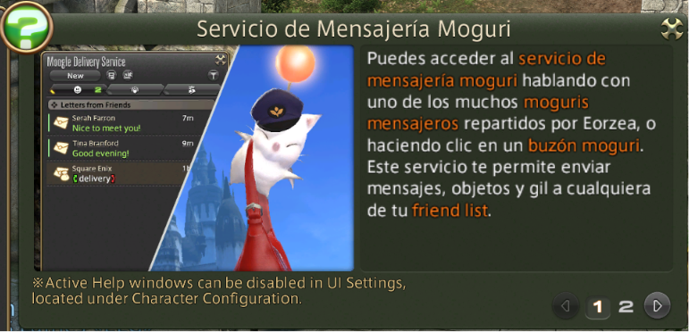

# Language pack en español para FFXIV (no oficial)

**Español** · [English](README.en.md)

Traducción al español de los textos de Final Fantasy XIV, pensada para el plugin de Dalamud
**Gubal Library**.

Esta traducción no modifica los ficheros originales del juego.

> [!WARNING]
> **Este proyecto no es una localización profesional ni aspira a sustituir a una oficial.**
>
> Es una traducción hecha por aficionados, sin ánimo de lucro y sin ninguna relación con Square Enix
> ni con sus filiales. Los textos originales son propiedad de Square Enix.
>
> Está hecha en su mayor parte con IA y supervisión humana, así que **habrá errores**.

## Ejemplos

El juego en marcha con este pack instalado. Nada de esto es un montaje ni una superposición: el
juego leyó esas palabras de un fichero y las dibujó él mismo.

## Motivación

Esto es un esfuerzo de la comunidad hispanohablante: gente con ilusión por la saga que quiere verla
y difundirla en su idioma. Un idioma que hablan cerca de quinientos millones de personas repartidas
entre España y una veintena de países de América, y que sin embargo no está entre los cuatro en los
que Final Fantasy XIV lleva más de una década publicándose.

Buena parte de la saga sí se ha publicado en español a lo largo de más de veinte años, y de ahí
vienen términos que reconoce cualquier fan, veterano o recién llegado: moguri, kupó (con tilde :P),
molbol, cactilio. Ojalá acaben llenando Eorzea.

Lo de arriba no es una fórmula de cortesía: esto aspira a algo mucho más modesto que una
localización oficial y, con total transparencia, en su mayor parte está hecho con IA,
supervisión humana y el cariño de un grupo de fans de la saga.

Y si en algún momento Square Enix quisiera disponer de esta traducción, se la facilitaríamos con
muchísimo gusto. Nada nos gustaría más que ver Eorzea en español de forma
oficial y que este proyecto dejara de hacer falta.

## Criterios de traducción

**Traducción con IA supervisada y revisión humana.** Por el volumen de texto, el grueso lo traducen
modelos de lenguaje siguiendo instrucciones detalladas sobre terminología y criterio; el resultado se
revisa y se corrige.

**Precedencia de la saga.** Cuando un término tiene traducción oficial en algún Final Fantasy
publicado en español, esa forma tiene prioridad sobre cualquier alternativa. Ejemplos: *moogle* es
«moguri», *Limit Break* es «Límite», *the Mist* es «la Niebla» (Final Fantasy XII) y *morbol* es
«molbol» (Final Fantasy XII *The Zodiac Age* y Final Fantasy VII Remake). Cuando un título nunca se
publicó en español, como Final Fantasy Tactics, no hay precedente al que recurrir: el término se
decide aquí y se documenta como decisión propia.

**Tres idiomas de referencia, cada uno con una función distinta.** Cada línea se traduce con las
versiones inglesa, francesa y japonesa delante, que no son tres variantes equivalentes del mismo
contenido:

- **Inglés.** Es el texto que el jugador ve en pantalla, y determina qué se dice.
- **Japonés.** Es la versión original de Final Fantasy XIV y aporta la
  intención, el registro de cada personaje, los honoríficos y los tics de habla que el inglés tiende
  a neutralizar.
- **Francés.** Al compartir estructura gramatical con el español, resuelve género, número y
  tratamiento. El inglés no distingue entre tú y usted; el francés sí, de modo que la formalidad de
  cada personaje se deduce de ahí.

Las divergencias entre las tres versiones son un dato, no una anomalía. En buena parte del contenido
ambiental el equipo inglés reescribió los diálogos mientras el francés y el japonés siguen el
original: en esos casos se traduce desde el inglés, pero la divergencia avisa de que la escena fue
reinterpretada y conviene revisar el tono.

**El texto de partida no es una frase fija.** Muchas líneas llevan elementos que el juego completa al
mostrarlas: el nombre del jugador, su género, una cantidad. El español exige más concordancia que el
inglés, así que la traducción se escribe para que funcione en todas las combinaciones posibles y no
solo en la que se tenga delante.

**Cada tribu y cada facción tienen voz propia.** Los sylphs hablan de sí mismos en tercera persona,
los kobolds articulan a través de la máscara, los Sahagin sisean y los goblins comprimen las palabras
en compuestos. Esos registros se fijan una vez y se mantienen a partir del material ya traducido, en
lugar de reinventarse en cada misión.

## Estado

Versión de juego **2026.08.05.0000.0000**. Traducidas **134.904 de 389.449 líneas, un 34,6 %**.

### Lo que ya vas a ver en español

| Qué es | Líneas | En español | |
|---|---|---|---|
| Lo que dicen los NPC al hablarles, sus gritos y los bocadillos sobre su cabeza | 42.647 | 42.647 | **100 %** |
| Objetivos y avisos dentro de mazmorras, gestas, incursiones y contenido público | 11.684 | 11.684 | **100 %** |
| Mensajes de combate, avisos rojos de mazmorra y textos del sistema | 8.465 | 8.452 | **100 %** |
| **A Realm Reborn**: la historia principal, sus escenas y todas las misiones de clase y de trabajo | 29.821 | 29.812 | **100 %** |
| Escenas con voz de **Dawntrail** | 5.531 | 5.531 | **100 %** |
| **A Realm Reborn**: los nombres de todas sus misiones | 1.573 | 1.573 | **100 %** |
| Las guías del juego: Occult Crescent, Palacio de los Muertos, mahjong, viviendas, Bozja | 1.630 | 1.630 | **100 %** |
| Los tutoriales que el juego te ofrece | 969 | 969 | **100 %** |
| **The Occult Crescent**, la historia completa | 895 | 895 | **100 %** |
| Menús de servicios: Gran Compañía, Gold Saucer y similares | 480 | 480 | **100 %** |
| **A Realm Reborn**: las misiones secundarias de las tres ciudades | 10.912 | 10.780 | **99 %** |
| **A Realm Reborn**: las tribus aliadas | 6.302 | 5.679 | **90 %** |
| Historia principal de **Dawntrail** | 11.368 | 9.807 | **86 %** |

### Lo que está en marcha

| Qué es | Líneas | En español | |
|---|---|---|---|
| Misiones de clase y de trabajo de las expansiones | 43.413 | 3.172 | 7 % |
| Lo que le queda a **A Realm Reborn**: eventos, cierre de la historia 2.x, gestas y reliquias | 10.612 | 683 | 6 % |
| Misiones secundarias de las expansiones | 44.190 | 659 | 1 % |
| Historia principal, de **Heavensward** a **Endwalker** | 35.896 | 0 | 0 % |
| Escenas con voz, de **Heavensward** a **Endwalker** | 18.862 | 0 | 0 % |
| Tribus, eventos de temporada, gestas y colaboraciones de las expansiones | 60.036 | 8 | 0 % |
| Conversaciones con NPC de servicio: mercaderes, alquileres, viajes | 28.777 | 113 | 0,4 % |
| Resto: Hildibrand, títulos de las expansiones, Buscador de misiones, contenido 7.x | 15.386 | 330 | 2 % |
| **Total** | **389.449** | **134.904** | **34,6 %** |

### Cómo leer estas cifras

**Están repartidas entre las siete expansiones a la vez**, así que ninguna fila de la tabla dice
cuánto de *tu* partida está en español. **A Realm Reborn se está cerrando por completo antes de pasar
a la siguiente**, y va muy por delante de lo que sugiere el total: de ARR ya están terminados el hilo
principal, las secundarias de las tres ciudades y **todas las misiones de clase y de trabajo**, de la
primera del gremio al final de cada trabajo, cada una con sus diálogos, su diario, sus objetivos y
sus avisos.

Un personaje nuevo que empiece hoy encuentra el juego en español casi de principio a fin hasta
terminar A Realm Reborn. A partir de Heavensward, la historia principal y las escenas con voz están
a medias y el resto va apareciendo por tandas.

**Los textos que el juego arma sobre la marcha ya entran en la cuenta.** Son las líneas que se montan
juntando trozos —«has entrado en *tal sitio*», «*tal sala* se sellará en *tantos* segundos»— y que
antes ni se traducían ni se contaban. Ya están traducidas las 1.685 que aparecen en el registro de
combate, los sellos de mazmorra y los avisos de grupo; quedan 1.190 dentro de misiones y de menús de
servicio.

**Y 126 líneas que ninguna extracción había visto nunca.** Son las que no tienen ni una palabra
fuera de un condicional —«Obtienes 5 earth clusters», «Desintetizas…», los emotes del registro, los
tutoriales que cambian según juegues con ratón o con mando—, y el filtro que descarta las columnas
sin texto se las llevaba por delante. Ya están dentro y traducidas.

**Lo que aparece como terminado está verificado**, no estimado: cada línea entregada se comprueba
contra el texto original antes de publicarse.
